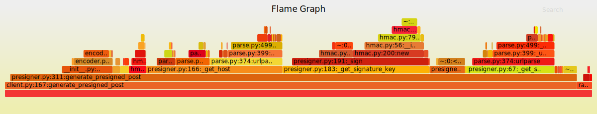

# SignURLarity

Lightweight library to presign URLs compatible with what boto does.

## Installation

```bash
pip install signurlarity
```

## tests

[installation pixi](https://pixi.sh/latest/advanced/installation/)

This will run functionnal tests.
It will spawn docker container to test against `rustfs`

```bash
pixi run unit-test # add any pytest option you want
```

Any `pytest` argument can be added

## pre-commit

SignURLarity uses [`pre-commit`](https://pre-commit.com/) to format code and check for issues.
The easiest way to use `pre-commit` is to run the following after cloning:

```bash
pixi run pre-commit install
```

This will result in pre-commit being ran automatically each time you run `git commit`.
If you want to explicitly run pre-commit you can use:

```bash
pixi run pre-commit # (1)!
pixi run pre-commit --all-files # (2)!
```

1. Runs `pre-commit` only for files which are uncommitted or which have been changed.
2. Runs `pre-commit` for all files even if you haven't changed them.


## Perf tests

For a full performance comparison, run

```bash
pixi run perf-comparison
```

This will compare the results of `boto` and `signurlarity` against rustfs for python version 3.11, 3.12, 3.13 and 3.14, and generate `json` files in `/tmp/perf_test`

If you want to run it for a specific version only:

```bash
pixi run -e py314 perf-test --perf-test-dir=/whatever/you/want
```

you can then display it with

```bash
pixi run -e py314 display-perf-comparison --perf-test-dir=/whatever/you/want
```

## Profiling tests

You can run profiling tests


```bash
pixi run -e py314 profile-test -s --perf-test-dir=/whatever/you/want
```

This will generate `prof` [files](https://docs.python.org/3/library/profile.html)


You can convert it in svg and open it in your web browser like so


```shell
pixi shell -e py314
flameprof --format=log profile_generate_presigned_post/presigned_post.prof | flamegraph > profile_generate_presigned_post/presigned_post.svg
```

:

 
